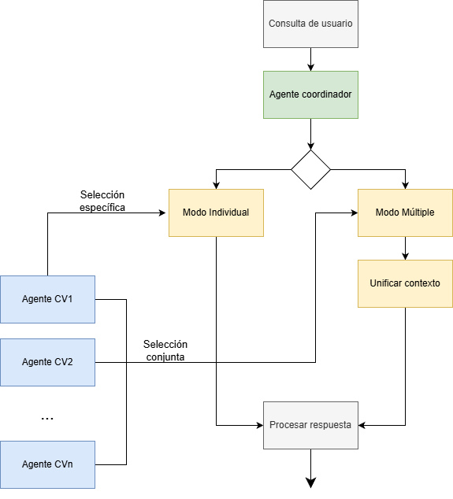

# CVChat

Usa un chatbot para consultar información sobre mi Curriculum Vitae.

CVChat es una aplicación tipo “chatbot + RAG (Retrieval-Augmented Generation)” que permite hacer preguntas a un Curriculum Vitae (CV) como si fuera un “documento conversacional”. En lugar de leer un PDF o un texto, un usuario puede simplemente preguntar y obtener respuestas en lenguaje natural.

## Tecnologías usadas

**Pinecone**: Base de datos vectorial para almacenar embeddings (representaciones vectoriales de fragmentos de texto del CV) y luego recuperar los fragmentos más relevantes ante una consulta escrita en lenguaje natural basándose en la similitud de la pregunta con distintos *chunks* de texto ingestado.

**Groq**: Motor/backend de LLM (modelo de lenguaje) que permite usar un modelo preentrenado para interpretar la consulta del usuario y generar respuestas coherentes basándose en el contexto recuperado por Pinecone para especificar la respuesta.

**Docker**: Contenerizarización de la aplicación para facilitar el despliegue del backend y frontend (y servicios asociados) sin preocuparse por dependencias, versiones, conflictos, etc. e independizar la aplicación del Sistema operativo utilizado. *En sistemas Windows es obligatorio abrir la aplicación "Docker Desktop" para desplegar los contenedores*. Las comunicaciones internas entre los distintos módulos también se pueden configurar fácilmente en este sistema.

Frontend + Backend combinando modelos de embeddings de 768 dimensiones (`all-mpnet-base-v2` para representar los prompts y `llama-3.3-70b-versatile` en Groq para generar las respuestas).

## Sistema multiagente

Para tratar más precisamente con cada CV que se proporcione al sistema, se encapsula la estructura mencionada anteriormente en "agentes especializados" capaces de capturar contexto más específico de cada uno de los documentos proporcionados.

Luego un agente coordinador en un nivel superior reúne todos los fragmentos de contexto desde la consulta realizada por el usuario y decide cuáles son los agentes a los que se les debe hacer consultas más fragmentadas y específicas.

El agente coordinador tiene dos modos de funcionamiento:

1. En caso de que se solicite información de una persona en particular, el solo se consultará al agente de ese documento en específico para obtener la información requerida. En caso de que se solicite información particular pero no se especifique de quién buscará la respuesta en el documento marcado *por defecto*.

2. En caso de consultas genéricas o comparativas el agente propagará la pregunta a todos los agentes necesarios y unirá los fragmentos de contexto para dar una respuesta más informada de cada uno de los documentos involucrados.

El siguiente esquema ilustra cómo es el flujo de información en el sistema:



## Estructura del repositorio

Entre los principales directorios y archivos se encuentran: 

* `backend/`: Lógica servidor/backend del chatbot que maneja embeddings, indexación, consulta a Pinecone, generación con Groq y API de comunicación con el frontend.

* `frontend/`: Interfaz web para interactuar con el chatbot desde el navegador.

* `RAG_documents/`: Documentos a indexar de manera automática durante el despliegue de la app: textos, PDF, markdown, u otros formatos que contienen la información del curriculum.

* `.gitignore`, `docker-compose.yml` para administración del repositorio y despliegue con contenedores.

## Ejecución

1. Clonar el repositorio:

``` sh
git clone https://github.com/Jugarov/CVChat.git
cd CVChat
```

2. Configurar credenciales necesarias:

En el archivo `backend/.env` es necesario configurar:

* La API key para Pinecone

* La API key para Groq

3. Construr y levantar los contenedores con Docker:

El repositorio deja la configuración preparada para desplegar la aplicación mediante la ejecución del siguiente comando:

``` sh
docker compose up --build
```

Esto iniciará el backend, frontend y los servicios necesarios (indexación, vector-db, etc.).

4. Abrí la aplicación en tu navegador (http://localhost:3000 por defecto) y comenzá a chatear con tu CV.

## Ejemplo de uso

El archivo `demo.mp4` que se puede encontrar en este repositorio muestra un ejemplo funcional de la aplicación:

[![Video Demo]](./demo.mp4)
